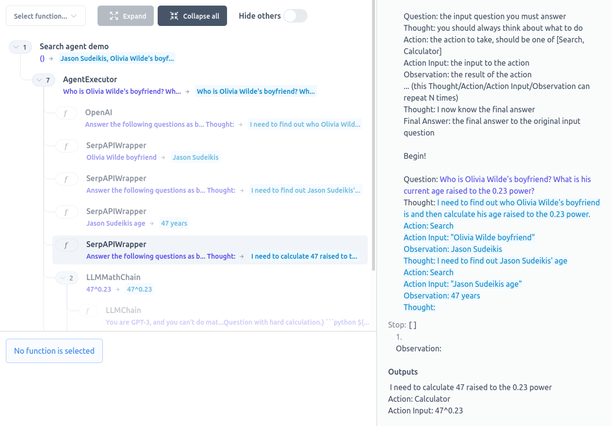

# LangChain Visualizer

Adapts [Ought's ICE visualizer](https://github.com/oughtinc/ice) for use with [LangChain](https://github.com/hwchase17/langchain) so that you can view LangChain interactions with a beautiful UI.



You can now

- See the full prompt text being sent with every interaction with the LLM
- Tell from the coloring which parts of the prompt are hardcoded and which parts are templated substitutions
- Inspect the execution flow and observe when each function goes up the stack
- See the costs of each LLM call, and of the entire run, if you are using OpenAI's `text-davinci-003` model

## Quickstart

Install this library:

```bash
pip install langchain-visualizer
```

Note that if you're on a Linux distribution, you may need to install libyaml first:

```bash
apt install -y libyaml-dev
```

Then:

1. Add `import langchain_visualizer` as **the first import** in your Python entrypoint file
2. Write an async function to visualize whichever workflow you're running
3. Call `langchain_visualizer.visualize` on that function

For an example, see below instructions on reproducing the screenshot.


### Running the example screenshot

To run the example you see in the screenshot, first install this library and optional dependencies:

```bash
pip install langchain-visualizer google-search-results openai
```

If you haven't yet set up your [OpenAI API keys](https://openai.com/api/) or SERP API keys, you can [replay the recorded interactions](https://github.com/amosjyng/vcr-langchain) by cloning this repository and running

```bash
$ pip install vcr-langchain
$ OPENAI_API_KEY=dummy python tests/agents/test_langchain_getting_started.py
```

If you have set them up, you can run the following script (adapted from [LangChain docs](https://langchain.readthedocs.io/en/latest/modules/agents/getting_started.html)):

```python
import langchain_visualizer
import asyncio
from langchain.agents import initialize_agent, load_tools
from langchain.llms import OpenAI

llm = OpenAI(temperature=0.7)
tools = load_tools(["serpapi", "llm-math"], llm=llm)
agent = initialize_agent(tools, llm, agent="zero-shot-react-description", verbose=True)
async def search_agent_demo():
    return agent.run(
        "Who is Olivia Wilde's boyfriend? What is his current age raised to the 0.23 "
        "power?"
    )

langchain_visualizer.visualize(search_agent_demo)
```

A browser window will open up, and you can actually see the agent execute happen in real-time!

### Jupyter notebook support

Jupyter notebooks are now supported! To use this inside a Jupyter notebook, **make sure to import the `visualize` function from `langchain_visualizer.jupyter` instead.**

Please look at [the demo notebook](/tests/demo.ipynb) to see an example of how it can be used in Jupyter.

### Visualizing embeddings

If you want to also visualize documents being chunked up for embeddings, you can now do so by calling the `visualize_embeddings` function before you visualize the main chain:

```python
from langchain_visualizer import visualize, visualize_embeddings

async def run_chain():
    ...

visualize_embeddings()
visualize(run_chain)
```

## Why not just use LangChain's built-in tracer?

For me personally:

- I prefer the ICE UI. In particular:
    - I like the colored highlighting of parts of the prompt that are filled-in template variables
    - I like the ability to quickly inspect different LLM calls without leaving the trace page
- I prefer the visualization of my agent logic to remain static when LLM calls are cached
- I prefer seeing when the tool (e.g. `PythonREPL`) actually gets called, rather than just the high-level execution of the chain (e.g. `LLMMathChain`)

That being said, LangChain's tracer is definitely better supported. **Please note that there is a lot of langchain functionality that I haven't gotten around to hijacking for visualization.** If there's anything you need to show up in the execution trace, please open a PR or issue.

## My other projects

Please check out [VCR LangChain](https://github.com/amosjyng/vcr-langchain), a library that lets you record LLM interactions for your tests and demos!
